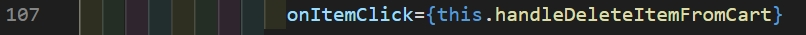

# Tutorial APAP
## Authors
* **Qonita Nur Iffat** - *1906307233* - *APAP-C*

---
## Tutorial 8
1. Ceritakan langkah - langkah yang kalian lakukan untuk solve LATIHAN no.1, dan mengapa kalian melakukan langkah - langkah tersebut?  
**Jawab:**  
setelah melakukan this.loadData() , saya mengosongkan statenya kembali dengan cara this.setState({ tittle: "", price:0 , description: "",category:””,quantity:0, }) agar ketika membuka modalnya, fieldnya sudah tidak terisi lagi.

2. Jelaskan fungsi dari async dan await!  
**Jawab:** 
Menurut saya, await digunakan untuk menunggu Janji. Ini dapat digunakan di dalam blok Async saja. await membuat JavaScript menunggu sampai hasil dikembalikan. Perlu dicatat bahwa itu hanya membuat blok fungsi async menunggu dan bukan keseluruhan eksekusi program.

3. Masukkan jawaban dari Screenshot yang diperintahkan di halaman 9 pada Component Lifecycle pada pertanyaan ini. 
**Jawab:** 

4.  Jelaskan fungsi dari componentDidMount, shouldComponentUpdate, componentDidUpdate, componentWillReceiveProps, componentWillUnmount.
Notes : Penjelasan harus mencantumkan “kapan fungsi dipanggil” dan “use case apa saja yang biasanya menggunakan lifecycle method tersebut”. 
**Jawab:** 
       - componentDidMount:fungsi dipanggil ketika komponen selesai dibuat, usecase yang biasa menggunakannya adalah ketika ingin mengetahui suatu komponen selesai dibuat.
       - shouldComponentUpdate: fungsi dipanggil ketika property atau state dari komponen telah berubah , usecase yang biasa menggunakannya adalah ketika ingin mengetahui perubahan porps/state dari komponen terkait 
       - componentDidUpdate: fungsi dipanggil ketika sebelum atatu sesudah komponen di render kembali , usecase yang biasa menggunakannya adalah ketika ada pekerjaan manual dari luar react yang mengupdate si component. 
       - componentWillReceiveProps: fungsi dipanggil ketika dipanggil sebelum komponen menerima props yang nilainya telah berubah , usecase yang biasa menggunakannya adalah ketika mengubah si component. 
       - componentWillUnmount: fungsi dipanggil ketika ingin menghancurkan/menghapus/menyingkirkan komponen , usecase yang biasa menggunakannya adalah ketika ingin unsubscribe

## Tutorial 7
1. Jelaskan apa yang Anda lakukan di latihan dalam satu paragraf per-soal. Berikan screenshot sebagai ilustrasi dari apa yang Anda jelaskan.
   - **Latihan 1**
   **Penjelasan:** Pada latihan 1 ini, saya menambahkan fungsi baru yang bernama handleDeleteItemFromCart. Fungsi ini merupakan fungsi yang dapat menghapus barang yang telah kita pilih sebelumnya untuk dimasukkan kedalam keranjang. Saya mengubah props inCart menjadi bernilai false, artinya barang sudah tidak ada lagi di dalam keranjang. Lalu, penghapusan dapat terjadi karena saya menggunakan method splice.
    
    
   
   - **Latihan 2**
   **Penjelasan:** Pada latihan 2 ini, saya membuat fungsi increase dan decrease yang mana kedua fungsi tersebut salah satunya akan dipanggil pada fungsi handleAddItemToChart dan handleDeleteItemFromCart. Dalam penyesuain balance ini, saya juga menggunakan setState untuk mengubah nilai balance sebelumnya menjadi nilai balance yang telah dimodifikasi, baik ditambah (ketika delete item) atau dikurang (ketika add item).

   
   - **Latihan 3**
   **Penjelasan:** Pada latihan 3 ini, pada fungsi decreaseBalance saya membuat kondisi untuk memberikan alert kepada user bahwa balance tidak cukup lagi ketika menambahkan item yang nilainya lebih besar daripada balance yang user punya. 

   
2. Menurut pemahaman kamu selama pengerjaan tutorial ini, apa perbedaan antara state dan props?
   State merupakan data private yang disimpan pada suatu component. Data ini tidak dapat diakses oleh component lainnya dan hanya tersedia dalam component tersebut yang mana hanya component yang terkait pula yang dapat melakukan pengubahan nilai tersebut. Sedangkan, props sendiri merupakan suatu parameter dalam suatu component. Props juga dapat dikatakan sebagai suatu yang yang miliki fungsi untuk berkomunikasi antar componeent lain.
   
3. Menurut kamu, apakah sebaiknya kita menggunakan component (e.g. List, Item) dalam React? sebutkan alasannya.
   Menurut saya, penggunaan component memiliki tujuan agar mudah dalam dilakukan pengimplementasian user interfacenya. Hal ini dikarenakan terdapat beberapa code yang dapat di-re use. Selain itu, begian-bagian tersebut dapat disusun menjadi satu secara utuh. Pada tutorial kali ini adalah ketika membuat component List dimana dapat digunakan kembali dengan memasukkan value untuk property title, item, onItemClick, dan isShopList untuk melakukan penyesuaian pada bagian baru yang ingin dengan melakukan import component tersebut.
   
4. Apa perbedaan class component dan functional component?
   Functional component merupakan komponen yang memiliki sifat statless (tidak menggunakan state). Hal ini dikarenakan functional component hanya menerima data dan menampilkan dalam beberapa bentuk terutama yang bertanggung jawab dalam melakukan render user interface. Functional component menggunakan fungsi JS yang sederhana yang mana hanya mengembalikan UI HTML. Functional component juga tidak menggunakan method render dalam melakukan implementasi. Sedangkan, class component merupakan komponen yang memiliki sifat stateful. Hal ini dikarenakan mengimplementasikan logika dan state. Class component juga menggunakan metode render() dalam mengembalikan html. Dalam pengimplementasiannya, Class component juga menggunakan this dalam mengkses props ataupun state.
   
5. Dalam react, apakah perbedaan component dan element?
   Perbedaan dari component dan elemen terletak pada fungsinya. Elemen memiliki fungsi untuk menggambarkan apa saja yang ingin dilihat pada layar, kita juga dapat menyebutnya sebagai "bahan dasar" pada komponen. Dalam react, elemen bersifat immutable yang mana artinya kita tidak dapat melakukan perubahan pada elemen anak ataupun attributnya. Sedangkan, component memiliki fungsi untuk menerima props dan mengembalikan react element yang memvisualisasikan terhadap apa yang ditampilkan pada website. Component sendiri memiliki UI yang bersifat independent, isolated, dan reusable. Oleh karena itu kode akan lebih praktis karena tidak redundan.

---
## Tutorial 6
1. Jelaskan secara singkat perbedaan Otentikasi dan Otorisasi! Di bagian mana (dalam kode yang telah anda buat) konsep tersebut diimplementasi?
    Otentikasi adalah suatu proses yang digunakan untuk melakukan verifikasi terhadap user yang sedang masuk (siapa saya). Hal ini terjadi ketika suatu user akan masuk ataupun login ke website.Sedangkan, Otorisasi adalah suatu proses untuk melakukan verifikasi akses user untuk melakukan sesuatu. Hal ini terjadi ketika terdapat role-role tertentu yang dapat melakukan tambah user maupun tambah bioskop.
    Berikut adalah implementasi kodenya:
    
    Implementasi otentikasi pada class WebSecurityConfig

        @Autowired
            public void configAuthentication(AuthenticationManagerBuilder auth) throws Exception{
                auth.userDetailsService(userDetailsService).passwordEncoder(encoder());
            }

     Implementasi otorisasi pada class WebSecurityConfig

        .authorizeRequests()
                        .antMatchers("/css/**").permitAll()
                        .antMatchers("/js/**").permitAll()
                        .antMatchers("/user/add").hasAuthority("ADMIN")
                        .antMatchers("/user/viewall").hasAuthority("ADMIN")
                        .antMatchers("/user/delete").hasAuthority("ADMIN")
                        .antMatchers("/penjaga/**").hasAuthority("MANAGER")
                        .anyRequest().authenticated()
                        
2. Apa itu BCryptPasswordEncoder? Jelaskan secara singkat cara kerja dan tujuannya.
Sebuah class implementasi PasswordEncoder yang menggunakan fungsi hashing kuat BCrypt. Bcrypt ini adalah algoritma "one-way hashing" yang memiliki arti saat password telah dialkukan enkripsi, maka tidak bisa lagi dikembalikan (dekrip). Cara kerjanya secara singkat adalah class ini akan menggunakan method encode dengan parameter password yang ingin dienkripsi. Kemudian, password akan dienkripsi dengan algoritma "one-way hashing". Setelah itu, akan mengembalikan hasil password yang sudah di-hashing. Tujuannya agar password tidak diketahui oleh orang lain kecuali pemilik password, bahkan pembuat website atau pemilik database sekalipun karena pada database akan disimpan berupa password yang sudah dienkripsi.

3. Apakah penyimpanan password sebaiknya menggunakan encryption atau hashing? Mengapa demikian?
Ecryption dan hasing memiliki arti yang berbeda dikarenakan istilah tersebut adalah dua hal yang berbeda. Pertama, Ecryption sendiri merupakan proses dimana terjadi pengubahan suatu pesan normal menjadi pesan yang tidak mudah dibaca (ciphertext). Ciphertext tersebut diperolah dari ecryption yang dapat diubah menjadi plaiintext dengan ecription key. Sedangkan hashing key adalah proses pengubahan suatu informasi yang menjadi kunci dengan menggunakan hash function dimana informasi tersebut tidak dapat diambil dari hash key dengan cara apapun. Oleh karena itu, berdasarkan dari penjelasan sebelumnya, penyimpanan password sebaiknya menggunakan hashing.

4. Jelaskan secara singkat apa itu UUID beserta penggunaannya!
UUID (Universally Unique Identifier) adalah kode yang memiliki jumlah hashing terbanyak yaitu 32 karakter dimana berfungsi sebagai keamanan data. UUID di-generate untuk id pengguna. Dibandingkan dengan BCrypt yang merupakan password yang berguna untuk mengamankan id dari hacking. Dapat bahwa dipastikan UUID yang tergenerate unik untuk tiap objek yang ada di internet, sehingga id yang dimiliki oleh pengguna akan aman-aman saja.

5. Apa kegunaan class UserDetailsServiceImpl.java? Mengapa harus ada class tersebut?
class UserDetailsServiceImpl.java akan memberikan informasi terkait Otentikasi serta Otorisasi akun yang ada pada class lain. Class ini harus diimplementasikan, apabila tidak informasi tersebut tidak dapat diberikan, kemampuan tersebut ada karena class mengimplementasikan UserDetailService. UserDetailService merupakan interface yang ada dari Spring Security. Selain itu, class ini meng-override loadUserByUsername() yang bisa dilakukan kustomisasi untuk pencarian user.

## Tutorial 5
1. Apa itu Postman? Apa kegunaannya?

Postman merupakan suatu aplikasi yang berupa plugin untuk membagikan, membuat, serta melakukan uji coba REST API. Dengan menggunakan aplikasi ini, developer akan mudah dalam membuat serta melakukan penyimpanan request HTTP/s yang mana Postman juga akan menampilkan response dari request tersebut. Postman dapat membantu developer dalam mengembangkan APIs dengan cara yang lebih mudah dan efisien serta untuk menguji API yang telah mereka buat.
    
2. Jelaskan fungsi dari anotasi @JsonIgnoreProperties dan @JsonProperty.

@JsonIgnoreProperties memiliki fungsi untuk mengabaikan properti logika yang ditentukan dalam serialisasi dan deserialisasi JSON yang dianotasi di class. @JsonIgnoreProperties memiliki elemen yaitu allowGetters, allowSetters, ignoreUnknown dan value. Fungsi dari value element adalah untuk menentukan mana properti yang akan diabaikan.  @JsonProperty nemiliki kegunaan untuk menandai metode pengambil ataupun penyetel non-standar yang akan digunakan sehubungan dengan properti json.

3. Apa kegunaan atribut WebClient?

webClient berguna sebagai fondasi dan poin akses utama untuk API yang akan digunakan dengan aturan-aturan yang ada di API tersebut dimana webClient akan memberikan verifikasi req URI dengan objeck mock yang mana atribut tersebut merupakan interface yang dimiliki oleh Spring.

4. Apa itu ResponseEntity dan BindingResult? Apa kegunaannya?

ResponseEntity memiliki maksud untuk mewakili seluruh respons HTTP. Melalui ResponseEntity maka kita dapat melakukan kontrol apa pun yang masuk ke dalamnya seperti kode status, header, dan body. Tujuan utama ResponseEntity yaitu untuk menyediakan Lokasi ke sumber daya yang diubah. BindingResult menyimpan hasil validasi dan pengikatan serta berisi kesalahan yang mungkin telah terjadi. BindingResult harus muncul tepat setelah objek model yang divalidasi atau Spring gagal untuk memvalidasi objek tersebut dan melontarkan pengecualian.

## Tutorial 4
1. Jelaskan perbedaan th:include dan th:replace!
    Perbedaan dari th:include dan th:replace terletak pada penggunaan tag thymleaf. Pada th:include memiliki fungsi untuk memasukkan fragment yang telah ditentukan sebagai badan tag-hostnya, namun mengecualikasi tag fragmentnya. Sedangkan, th:replace memiliki fungsi untuk menggantikan tag host dengan fragment dimanakan hal ini menandakan bahwa akan dilakukan penghapusan pada tag host dan menggantikan tag host dengan melakukan penambahan fragment beserta dengan tag fragmentnya.

2. Jelaskan apa fungsi dari th:object!
    th:object merupakan tag thymleaf yang memiliki fungsi untuk melakukan pengiriman data dari suatu form yang dikirimkan dari view, kemudian data tersebut akan diterima oleh controller. Selain itu, tag dari th:object juga memiliki dapat mendefinisikan sesuatu menjadi suatu objek.

3. Jelaskan perbedaan dari * dan $ pada saat penggunaan th:object! Kapan harus dipakai?
    Perbedaan * dan $ ketika penggunaan th:object adalah ketika kita menggunakan * artinya kita ingin mengevaluasi suatu variabel dari th:object yang telah dideklarasi sebelumnya. Sedangkan apabila kita menggunakan $ artinya ketika akan dilakukannya suatu pengevaluasian keseluruhan variable atau atribut pada th:object.

## Tutorial 3
1. Tolong jelaskan secara singkat apa kegunaan dari anotasi-anotasi yang ada pada model (@AllArgsConstructor, @NoArgsConstructor, @Setter, @Getter, @Entity, @Table)
- @AllArgsConstructor: Anotasi ini memiliki fungsi untuk melakukan generate constructor hanya dengan satu parameter di dalam suatu class. Apabila terdapat @NotNull maka field tersebut akan memeriksa null pada parameternya.
- @NoArgsConstructor: Anotasi ini memiliki fungsi untuk melakukan generate constructor dengan tidak adanya parameter, lalu akan mengeluarkan suatu error berupa pesan error apabila terdapat constructor yang tidak dapat dibuat.
- @Setter: Anotasi ini memiliki fungsi untuk melakukan generate setter secara otomatis.
- @Getter: Anotasi ini memiliki fungsi untuk melakukan generate getter secara otomatis.
- @Entity: Anotasi ini memiliki fungsi bahwa suatu class tersebut akan terdefinisikan sebagai suatu entity pada database.
- @Table: Anotasi ini memiliki fungsi untuk melakukan penamaan tabel yang akan tersimpan pada suatu database.

2. Pada class BioskopDB, terdapat method findByNoBioskop, apakah kegunaan dari method tersebut?
                method finByNoBioskop adalah suatu method dimana method tersebut digunakan untuk mengambil sebuah entity dari bioskop dengan no-nya dan itu tersedia pada CrudRepository interface. Apabila kita memanggil method iniDengan menggunakan method ini, maka kita akan mendapatkan suatu entity berdasarkan no.
        
        sumber: https://www.netsurfingzone.com/jpa/spring-data-jpa-crudrepository-finbyid/
        
3. Jelaskan perbedaan kegunaan dari anotasi @JoinTable dan @JoinColumn
           Anotasi dari @Jointable akan digunakan ketika kita memiliki dua buah entity yang saling berhubungan dengan tabel yang berbeda dan ingin menyimpin id dari kedua entity tersebut ke dalam tabel yang terpisah. @JoinTable digunakan ketika kita ingin mengelola hubungan antar entity dari tabel lain. Sedangkan, @JoinColum menyimpan suatu id dari entity lain pada kolom baru di tabel yang sama. Anotasi ini digunakan apabila entity memiliki hubungan langsung seperti foreign key antar keduanya.

4. Pada class PenjagaModel, digunakan anotasi @JoinColumn pada atribut bioskop, apa kegunaan dari name, referencedColumnName, dan nullable dalam anotasi tersebut? dan apa perbedaan nullable dan penggunaan anotasi @NotNull
            name pada anotasi @JoinColumn pada atribut bioskop memiliki fungsi untuk memeberi nama kolom pada tabel tertentu, referencedColumnName sendiri berfungsi untuk merujuk nama dari kolom pada suatu tabel. Lalu, fungsi dari nullable dalam anotasi agar tidak ada penyimpanan null pada database. Perbedaanya adalah NotNull tidak dapat mengeluarkan null, sedangkan nullable dapat mengeluarkan null.
    
    sumber: https://thorben-janssen.com/hibernate-tips-whats-the-difference-between-column-nullable-false-and-notnull/#:~:text=The%20%40NotNull%20annotation%20triggers%20a,persist%20lifecycle%20event%20gets%20triggered.&text=The%20%40Column(nullable%20%3D%20false,t%20generate%20the%20table%20definition.

5. Jelaskan kegunaan FetchType.LAZY, CascadeType.ALL, dan FetchType.EAGER
                FetchType hibernate sendiri memiliki kegunaan yaitu untuk melakukan penentuan apakah seluruh collection object (child) tersebut di-load atau tidak sesaat setelah object parent di-fetch. *FetchType.LAZY* memiliki fungsi untuk *tidak* melakukan load semua collection object (child) saat object parent di-fetch. Per-load-an collection object (child) tersebut hanya dilakukan ketika secara ekspklisit dibutuhkan oleh getter method. Default fetching dari strateginya adalah @OneToMany dan @ManyToMany. Berbeda dengan *FetchType.EAGER* yang akan melakukan load pada semua collection object (child) sesaat setelah object parent di-fetch. Default fetching strateginya adalah @OneToOne dan @ManyToOne. Sedangkan yang terakhir, CascadeType.ALL berarti seluruh kegiatan operasi seperti uodate, delete, ataupun operasi data lainnya akan berpengaruh kepada suatu entity.
        
        sumber: https://7seasons.wordpress.com/2013/12/27/fetchtype-lazy-dan-eager-pada hibernate/#:~:text=FetchType%20pada%20Hibernate%20berfungsi%20untuk,FetchType

## Tutorial 2
1. Cobalah untuk menambahkan sebuah Bioskop dengan mengakses link berikut:
http://localhost:8080/bioskop/add?idBioskop=1&namaBioskop=Bioskop%20PAPA%20APAP&alamat=Maung%20Fasilkom&noTelepon=081xxx&jumlahStudio=10 
Apa yang terjadi? Jelaskan mengapa hal tersebut dapat terjadi!
Ketika saya membuka link tersebut, page yang muncul adalah whitelable error page. template might not exist. Hal ini dikarenakan belum dibuatnya template yang direturn oleh controller yaitu "add-bioskop". Controller ini berfungsi untuk mengatur logic dan route api dimana controller akan memanggil template HTML. apabila template tersebut tidak ada maka respon yang diberikan adalah error tersebut.

2. Menurut kamu anotasi @Autowired pada class Controller tersebut merupakan implementasi dari konsep apa? Dan jelaskan secara singkat cara kerja @Autowired tersebut dalam konteks service dan controller yang telah kamu buat.
Menurut saya, anotasi @Autowired pada class Controller digunakan agar constructor, setter method, getter method tidak perlu lagi untuk dibuat. Seluruh field atau property akan diisikan oleh Spring dengan object yang sesuai dengan tipe datanya. anotasi @Autowired pada class Controller merupakan suatu pengimplementasian dari konsep dependancy injection yang mana anotasi @Autowired pada class Controller tersebut dapat memasukkan dependensi objek secara implisit. Pada tutorial 2 kali ini, pengimplementasian tersebut ada pada controller untuk service.

3. Cobalah untuk menambahkan sebuah Bioskop dengan mengakses link berikut:
http://localhost:8080/bioskop/add?idBioskop=1&namaBioskop=Bioskop%20PAPA%20APAP&alamat=Maung%20Fasilkom&noTelepon=081xxx 
Apa yang terjadi? Jelaskan mengapa hal tersebut dapat terjadi.
Ketika saya membuka link tersebut, tampilan yang muncul adalah Whitelabel Error Page. There was an unexpected error (type=Bad Request, status=400). Required request parameter 'jumlahStudio' for method parameter type int is not present. Hal ini terjadi dikarenakan tidak adanya jumlahStudio pada link tersebut, sehingga link tersebut memberikan parameter yang kosong. Padahal, jumlahStudio adalah parameter yang wajib diisi.

4. Jika Papa APAP ingin melihat Bioskop dengan nama Bioskop Maung, link apa yang harus diakses?
Pada tutorial kali ini, saya menambahkan bioskop dengan nama Bioskop Maung dengan idBioskop 10. Saya melakukan penambahan pada link:
http://localhost:8080/bioskop/add?idBioskop=10&namaBioskop=Bioskop%20Maung&alamat=Maung%20Fasilkom&noTelepon=081xxx&jumlahStudio=10

    Link yang harus diakses untuk melihat Bioskop dengan nama Bioskop maung, yaitu:
    http://localhost:8080/bioskop/view?idBioskop=10

5. Tambahkan 1 contoh Bioskop lainnya sesukamu. Lalu cobalah untuk mengakses http://localhost:8080/bioskop/viewall , apa yang akan ditampilkan? Sertakan juga bukti screenshotmu.
Saya menambahkan bioskon dengan idBioskop 50 menggunakan link berikut:
http://localhost:8080/bioskop/add?idBioskop=50&namaBioskop=Bioskop%20Qwonz&alamat=Qwonz%20Fasilkom&noTelepon=081xxx&jumlahStudio=10
Tampilan: 

Tampilan mengakses viewall:

## Tutorial 1

### What I have learned today
Pada tutorial 1 ini, saya belajar banyak terkait bagaimana cara menggunakan Github dan Springboot. Mulai dari setup awal hingga membuat suatu website meskipun hanya dapat dibuka melalui localhost. Saya juga mengetahui bagaimana menggunakan @RequestParam dan @PathVarianle.

### Github

1. Apa itu Issue Tracker? Apa saja masalah yang dapat diselesaikan dengan Issue Tracker?
Issue tracker merupakan suatu software yang memungkinkan untuk melakukan pencatatan masalah ataupun bug serta melacak masalah tersebut hingga dapat diselesaikan. Masalah yang dapat diselesaikan diantaranya: pengembangan ide, elemen yang dirasa membuat pelanggan tidak nyaman, error dalam fitur, pull request, dan lainnya.

    source:
    https://www.zendesk.com/blog/issue-tracker/
    https://monday.com/blog/project-management/issue-tracker/

2. Apa perbedaan dari git merge dan git merge --squash?
Perbedaan dari git merge dan git meger --squash yaitu melayani tujuan yang berbeda. Apabila kita melakukan git merge maka dapat dilakukan penggabungan dari semua commit pada branch sumber dengan melakukan commit pada branch yang ingin dituju yang menghasilkan penggabungan pada branch serta pada master. Berbeda dengan git merge --squash, hasil dari penggabungan hanya akan menghasilkan satu commit pada branch yang dituju dengan semua perubahan yang telah tergabung menjadi satu.

    source:
    https://devblogs.microsoft.com/devops/squash-a-whole-new-way-to-merge-pull-requests/
    https://www.it-swarm-id.com/id/git/dalam-git-apa-perbedaan-antara-menggabungkan-squash-dan-rebase/968059910/

3. Apa keunggulan menggunakan Version Control System seperti Git dalam pengembangan
suatu aplikasi?
Version control system merupakan tools yang cukup penting untuk digunakan oleh software engineer. Hal ini dikarenakan VCS merupakan kumpulan dari perangkat lunak yang telah terintegrasi yang dapat mengelola perubahan kode seiring berjalannya waktu. Sistem ini akan menyimpan file sehingga mampu melacak setiap perubahan kode yang telah dilakukan. Git sebagai VCS sangat berguna untuk menangani multiple local branches yang memungkinkan software engineer dapat memiliki versi kode yang berbeda secara bersamaan dan dapat dipilih untuk dibagikan.

    source:
    https://glints.com/id/lowongan/version-control-system/#.YTjOuZ0zaHt
    https://www.seguetech.com/a-review-of-software-version-control-systems-benefits-and-why-it-matters/#:~:text=Git%20is%20especially%20useful%20for,later%20to%20merge%20the%20versions.

### Spring

4. Apa itu library & dependency?
Library merupakan kumpulan dari kode yang telah disediakan oleh framework yang akan kita gunakan. Kumpulan kode tersebut biasanya berada dalam package atau tempat lain sesuai dengan bahasa yang digunakan dimana kode tersebut akan dapat membantu user sehingga apabila user ingin menggunakan dapat langsung di import. Sedangkan dependency sendiri merupakan gambaran dari ketergantungan suatu program dengan program lainnya yang membuat program tersebut dapat bekerja. Sehingga, depedency ini dapat digunakan sesuai dengan kebutuhan program yang akan dibuat.

5. Apa itu Maven? Mengapa kita menggunakan Maven? Apakah ada alternatif dari Maven?
Maven merupakan Java Build Tools yang menggunakan konsep dari Project Object Model atau biasa disingkat dengan POM, dimana POM itu sendiri memiliki informasi serta konfigurasi yang akan digunakan oleh Maven untuk membuat suatu project. Maven biasa digunakan untuk mempermudah pengelolaan dan pembangunan suatu project serta dependency dan dokumentasinya. Penggunaan maven dikarenakan mavem dapat melakukan penambahan pada semua dependencies yang dibutuhkan secara otomatis dengan membaca POM file, serta terdapat kemudahan dalam penambahan dependency yang hanya dilakukan dengan cara menuliskan kode pada POM. Terdapat alternatif lain dari Maven adalah Gradle, CMake, dan Jenkins.

    source:
    https://medium.com/@acep.abdurohman90/mengenal-maven-sebagai-java-build-tools-5ba752f75812

6. Selain untuk pengembangan web, apa saja yang bisa dikembangkan dengan Spring
framework?
Selain untuk melakukan pengembangan web, Spring dapat digunakan untuk fasilitas mailing, membuat aplikasi enterprise, adanya beragam posi untuk melakukan pengaturan data ke database, serta dapat digunakan untuk membuat mobile app.

    source:
    https://socs.binus.ac.id/2017/10/04/framework-spring-java/

7. Apa perbedaan dari @RequestParam dan @PathVariable? Kapan sebaiknya
menggunakan @RequestParam atau @PathVariable?
@RequestParam digunakan untuk parameter kueri GET yang mana @RequestParam akan mengekstrak nilai dari string kueri yang dapat digunakan untuk melakukan fitering, sorting, dan pagination, sedangkan @PathVariable digunakan untuk bagian jalur dimana @PathVariable akan mengestrak nilai URI Path dalam variable Path yang nilainya tidak dapat dikodekan. Sehingga, @RequestParam akan lebih baik digunakan apabila kita ingin memberikan nilai yang statis. Sebaliknya, apabila kita ingin menggunakan nilai yang dinamis maka lebih baik menggunakan @PathVariable.

    source:
    https://edupro.id/questions/3370312/perbedaan-antara-pathvariable-requestparam-dan-requestbody

### What I did not understand

- [ ] Apabila terdapat error, saya masih bingung untuk menyelesaikannya.
- [ ] Fungsi yang ada pada Spring masih belum saya pahami lebih dalam.
- [ ] Saya masih bingung terkait alur pengerjaan Spring dan github dikarenakan kedua hal tersebut masih baru menurut saya.
